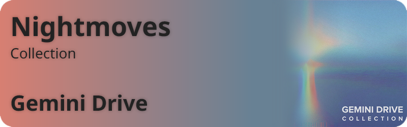

# NowPlayingWidget

Hacked together music widget for Windows. Customizable if you know HTML/CSS/JS.

## How to use

Just download the provided ZIP file, unpack anywhere, and run `NowPlaying.exe`. This is a compiled version of `NowPlaying.ahk`, an AutoHotKey script that allows me to hide the console window. You can access the console window and the widget using the tray icon in your taskbar.

## Notes

- The client widget as of now only handles playback from Spotify and Foobar2000, you can adjust this in `widget.html`.
- I've designed this with the Noto font in mind. You can download it [here](https://fonts.google.com/noto).

## Examples

Cherry-picked and badly cropped :)

